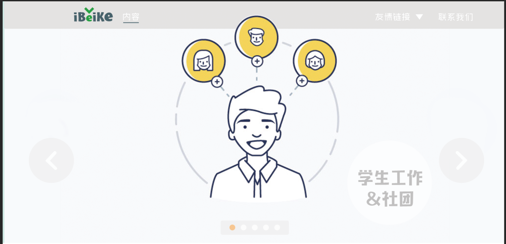

# 北科新生攻略 | iBeiKe团队 | PC端网页
***
> Demo:[http://hexo.abowloflrf.com/GuidesForNewer](http://hexo.abowloflrf.com/GuidesForNewer "北科新生攻略 | iBeiKe团队 | PC端网页")

***
## 大致样式如下

***

***

***
## 目前未完成的
### 导航栏
1. 往下拖后的颜色更改
2. 往下拖后logo更改
3. 友情链接引入
### 首页部分
1. 首页的报告两字偏移（等切的新图）
2. 首页按钮图片“生活”（等切的新图）
3. 首页按钮区域和正文区域的背景色
4. 首页正文部分（背景图加文字）
### 内容页部分
1. **正文部分**
2. **右侧部分固定的导航栏**
3. 图片轮播部分左右两侧箭头加入一些半透明阴影
4. 图片轮播下部分小点加入半透明阴影
