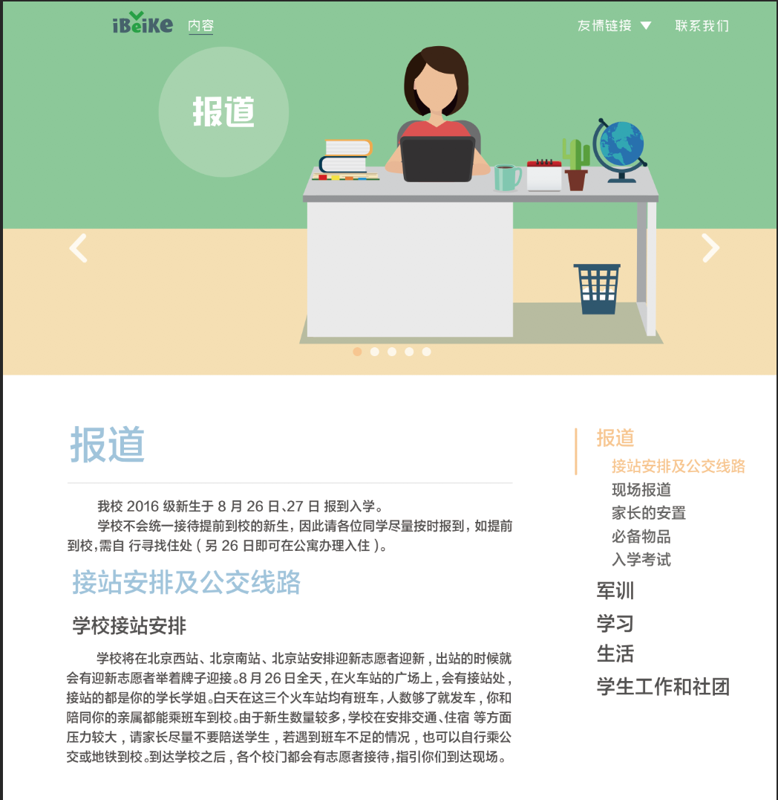

# 北科新生攻略 | iBeiKe团队 | PC端网页
***
> Demo:[http://hexo.abowloflrf.com/GuidesForNewer](http://hexo.abowloflrf.com/GuidesForNewer "北科新生攻略 | iBeiKe团队 | PC端网页")

***
## 大致样式如下

***

***

***

## 目前未完成的

### 导航栏
- ~~logo改为原版，稍微放大~~
- 友情链接引入
- 滑到图片后再变色？

### 首页部分
- ~~首页的报告两字偏移（等切的新图~~
- ~~首页按钮图片“生活”（等切的新图~~
- ~~首页按钮区域和正文区域的背景色~~
- ~~首页正文部分（背景图加文字）~~
- 首页icon4放大，学习生活按钮文字反了 

### 内容页部分
- **正文部分**
- **右侧部分固定的导航栏**
- 图片轮播部分左右两侧箭头加入一些半透明阴影
- 图片轮播下部分小点加入半透明阴影

### 联系我们部分
- 除了背景和导航栏的所有部分
